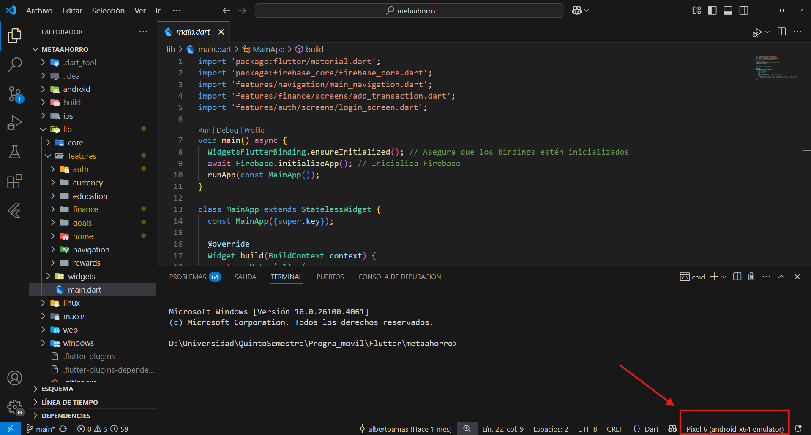

# MetaAhorro

Una aplicación para gestionar eficientemente tus finanzas personales y alcanzar tus metas de ahorro.

---

## 📑 Tabla de Contenidos

1. [Introducción](#1-introducción)
2. [Sobre el proyecto](#2-sobre-el-proyecto)
3. [Propósito del proyecto](#3-propósito-del-proyecto)
4. [Tecnologías](#4-tecnologías)
5. [Entorno de desarrollo](#5-entorno-de-desarrollo)
6. [Estructura de archivos](#6-estructura-de-archivos)
7. [Características principales](#7-características-principales)
8. [Cómo empezar](#8-cómo-empezar)
9. [Capturas de pantalla](#9-capturas-de-pantalla)
10. [Sobre el proyecto académico](#10-sobre-el-proyecto-académico)

---

## 1. 📱 Introducción

**MetaAhorro** es una aplicación móvil desarrollada en Flutter, diseñada para ayudar a los usuarios a **gestionar sus finanzas personales**, **establecer metas de ahorro** y hacer un seguimiento de sus ingresos y egresos en **múltiples monedas**.

---

## 2. 🔍 Sobre el proyecto

Este proyecto nace de la necesidad de una herramienta accesible, intuitiva y eficiente para la administración financiera personal. Su diseño está centrado en el usuario, con una interfaz moderna y sencilla.

---

## 3. 🎯 Propósito del proyecto

- Registrar y hacer seguimiento de transacciones financieras
- Gestionar presupuestos y visualizar balances
- Establecer y monitorear metas de ahorro
- Visualizar gráficos de gastos e ingresos
- Soportar múltiples monedas: **BOB**, **USD**, **USDT**

---

## 4. 🛠 Tecnologías

- **Flutter**: Framework para apps multiplataforma
- **Dart**: Lenguaje de programación
- **Firebase** (Authentication, Firestore, Storage)
- **Provider**: Gestión de estado
- **fl_chart**: Visualización de datos
- **Material Design**: Interfaz UI

---

## 5. 💻 Entorno de desarrollo

- Flutter SDK ≥ 3.0.0  
- Dart SDK ≥ 2.17.0  
- Android Studio o VS Code (con extensiones de Flutter y Dart)  
- Git  
- Firebase CLI  

---

## 6. 📁 Estructura de archivos

```
metaahorro/
├── android/
├── ios/
├── lib/
│   ├── features/
│   │   ├── auth/            → Autenticación
│   │   ├── finance/         → Gestión de finanzas
│   │   ├── goals/           → Metas de ahorro
│   │   ├── home/            → Pantalla principal
│   │   └── navigation/      → Navegación de la app
│   ├── shared/              → Componentes comunes
│   ├── utils/               → Funciones auxiliares
│   └── main.dart            → Punto de entrada
├── assets/                  → Imágenes, íconos, fuentes
├── test/                    → Pruebas
├── pubspec.yaml             → Configuración y dependencias
└── README.md
```

---

## 7. ✨ Características principales

- **Autenticación**  
  - Registro, login, recuperación de contraseña  
- **Dashboard financiero**  
  - Balance general  
  - Transacciones recientes  
  - Cambio de moneda  
- **Gestión de transacciones**  
  - Ingresos y gastos  
  - Filtros por fecha y categoría  
- **Metas de ahorro**  
  - Seguimiento de objetivos  
  - Notificaciones de progreso  

---

## 8. 🚀 Cómo empezar

1. Clona el repositorio:

```bash
git clone https://github.com/albertoamas/MetaAhorro.git
cd metaahorro
```

2. Asegúrate de tener la versión correcta de Flutter:

```bash
flutter --version
flutter upgrade
```

3. Limpia e instala dependencias:

```bash
flutter clean
flutter pub get
```

4. Requisitos para la ejecución:
   - **Actualmente solo compatible con dispositivos Android** (API 21+ / Android 5.0 Lollipop o superior)
   - Se recomienda usar un emulador de Android Studio, preferiblemente **Pixel 6**
   - Asegurate que el dispositivo seleccionado sea el  correcto, es decir un dispositivo Android
   

5. Ejecuta la aplicación:

```bash
flutter run
```

---

## 10. 🎓 Sobre el proyecto académico

MetaAhorro fue desarrollado como parte de un proyecto académico con el objetivo de aplicar conocimientos de desarrollo móvil multiplataforma utilizando Flutter y Firebase. La aplicación busca resolver un problema real: la falta de herramientas intuitivas para la gestión de finanzas personales y metas de ahorro.

Este proyecto representa una muestra del compromiso con el aprendizaje práctico, la experiencia de usuario y las buenas prácticas en el desarrollo de software moderno.

Desarrollado con ❤️ para el curso de **Programación Móvil** en la **Universidad Católica Boliviana Sede Tarija**.